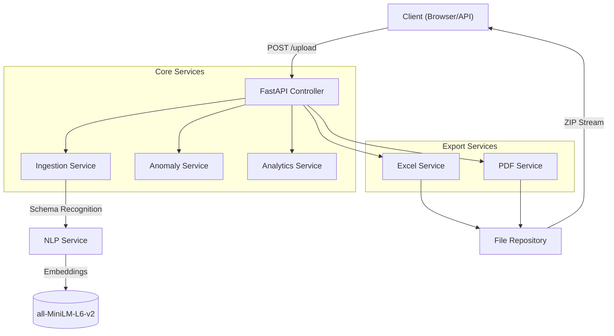
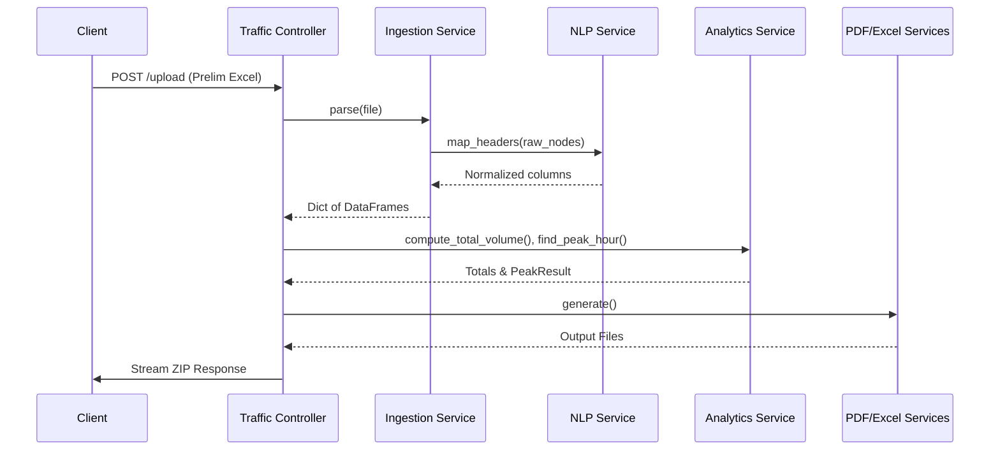
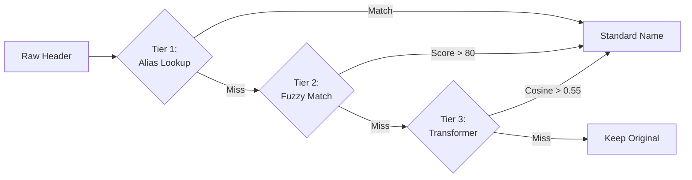
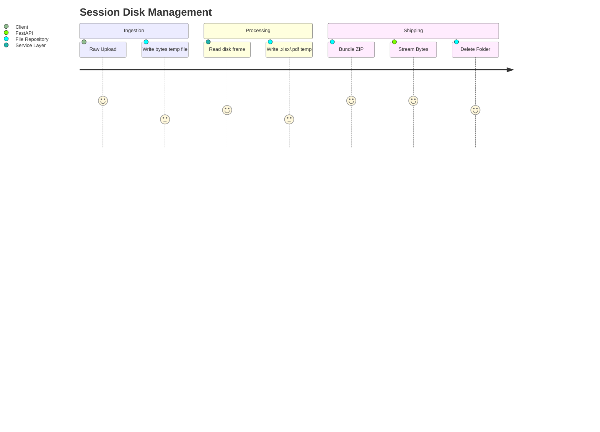

# 🚦 PeakPulse Engine

**PeakPulse Engine** is an automated, Dockerized FastAPI microservice designed to process traffic movement count data. It ingests preliminary Excel datasets, applies Advanced NLP and Machine Learning for data normalization and anomaly detection, computes standard traffic engineering analytics (Peak Hour, PHF), and outputs heavily stylized Final Excel reports alongside visually-rich PDF Sankey diagrams.

---

## ⚡ Features

1. **Intelligent Ingestion** — Uses HuggingFace's `all-MiniLM-L6-v2` transformer model to semantically recognize non-standard column headers (e.g., "Peds Counterclockwise" → "Peds CCW").
2. **Anomaly Detection** — Employs `IsolationForest` to strictly flag outliers and identify unusual spikes or potential sensor failures.
3. **Core Traffic Analytics** — Automatically identifies the highest 60-minute rolling window for AM and PM peaks, and calculates the Peak Hour Factor (PHF).
4. **Pixel-Perfect Export** — Generates an 8-sheet Final Excel workbook formatted to precise industry standards.
5. **Modern Vector Diagrams** — Renders Sankey-style intersection flow diagrams with driver-perspective turning and logarithmic line scaling.
6. **Dockerized Deployment** — Packaged as a clean, stateless container with CPU-friendly AI models inside.

---

## 🚀 Getting Started

### Prerequisites
* Docker & Docker Compose
* *(Optional)* Python 3.10+ if running directly on host

### Running via Docker (Recommended)

1. **Build the container:**
   ```bash
   docker-compose build
   ```
2. **Start the service:**
   ```bash
   docker-compose up -d
   ```
3. **Verify Health:**
   ```bash
   curl http://localhost:8000/api/v1/health
   ```
4. **Test an Upload:**
   ```bash
   curl -X POST -F "file=@data/Preliminary Excel.xlsx" http://localhost:8000/api/v1/upload -o result.zip
   ```

### Running Locally (Virtual Environment)
```bash
python -m venv venv
venv\Scripts\activate
pip install -r requirements.txt
uvicorn app.main:app --reload --port 8000
```
Run tests via `pytest tests/ -v`.

---

# 📖 Technical Walkthrough

A comprehensive and highly visual breakdown of the PeakPulse Engine backend architecture. This guide details where every function is implemented and how it operates within our automated processing pipeline.

## 🏗️ System Architecture Flow

The backend is built around a robust, dependency-injected Controller-Service-Repository pattern. It utilizes Python `pandas` for core data manipulation and connects multiple specialized AI/analytical services to produce final reports from raw inputs.



## 🛠️ Application Setup & Controllers

> [!NOTE]
> The `/upload` API endpoint is the heart of the engine. It ingests an Excel file and orchestrates the entire pipeline, returning a zipped bundle of reports.

<br>

### `app/main.py`
* **`lifespan`**: Handles application startup. Crucially, it pre-warms the NLP Transformer model by executing a mock schema mapping, preventing cold-start latency for the first user request.
* **`root`**: Provides API metadata and a fast redirect to `/docs`.

### `app/controllers/traffic_controller.py`
* **`upload(file)`**: The primary pipeline orchestrator.
  - Takes raw `UploadFile` → calls `ingestion.parse()`.
  - Computes peak hours and breakdowns via `analytics`.
  - Flags spikes via `anomaly_svc.detect_anomalies()`.
  - Generates Final Excel via `excel_svc` and Final PDF via `pdf_svc`.
  - Streams ZIP via internal async `_stream()` generator.
* **`validate(file)`**: Lightweight preview endpoint. Computes anomalies & peaks without generating heavy files.
* **`health()`**: Basic liveness probe.

### 🔄 API Data Lifecycle


## 🧩 Intelligent Services

### 1. Ingestion Engine (`app/services/ingestion_service.py`)
> [!IMPORTANT]
> Translates non-standardized raw preliminary Excel data into unified, robust pandas DataFrames.

*   **`parse()`**: Main entrypoint orchestrating sheet parsing and time rounding.
*   **`_parse_class_sheet()`**: Identifies rows corresponding to Leg, Direction, and headers. Correctly matches strings like "Peds CCW" to canonical movements.
*   **`_align_time_index()`**: Forwards/fills missing data and locks all data points into standard 15-minute intervals.
*   **`_normalise_timestamp()`**: Cleans fractional seconds (e.g. `06:29:59.870` → `06:30`).

### 2. Transformer NLP (`app/services/nlp_service.py`)
> [!TIP]
> Employs a blazing-fast, CPU-friendly 3-tier escalation strategy utilizing `all-MiniLM-L6-v2` for Semantic Column Tagging.

*   **`map_headers()`**: Maps raw column strings recursively.
*   **`_alias_lookup()`**: **Tier 1.** Static hash-map lookup for direct matches.
*   **`_fuzzy_match()`**: **Tier 2.** Levenshtein-distance token checks (score > 80 accepts).
*   **`_batch_semantic_match()`**: **Tier 3.** HuggingFace semantic cosine similarity matching against expanded natural language descriptions.
*   **`_ensure_model_loaded()`**: Lazy loads the Transformer architecture into memory.



### 3. Anomaly Detection (`app/services/anomaly_service.py`)
> [!CAUTION]
> Flags unlikely traffic permutations or failed sensor readings so operators can manually review them.

*   **`detect_anomalies()`**: Pulls approach totals to scan for irregularities.
*   **`_run_isolation_forest()`**: Feeds data into an `IsolationForest` ML model trained dynamically on the 24-hr study data distribution. Emits High/Medium/Low warnings on deviation boundaries.

### 4. Peak Traffic Analytics (`app/services/analytics_service.py`)
Performs standard Traffic Engineering arithmetic calculations per BRD.

*   **`compute_total_volume()`**: Folds 4 class sheets into moving baseline variables.
*   **`find_peak_hour()`**: Slides a 60-minute window across AM or PM bins to identify highest continuous volume.
*   **`compute_phf()`**: Calculates `Peak Hour Factor =  V / (4 × V_15)`.
*   **`compute_class_breakdown()`**: Appends mathematical matrices containing specific class % approach totals.

## 📊 Export Rendering Services

> [!NOTE]
> PeakPulse generates pixel-perfect clones of legacy reporting layouts using custom geometry rendering.

### Excel Generation (`app/services/excel_service.py`)
Uses `openpyxl` to burn 8 sheets identically tracking origin references.

*   **`generate()`**: Orchestrates multi-sheet writes.
*   **`_write_breakdown_sheet()`**: Loops data onto AM/PM blocks applying grid borders, dark-blue headers, zebra stripes, and explicit `%` number formats.
*   **`_merge_approach_cells()`**: Scans top header arrays to dynamically span/merge matching North/South blocks structurally.

### PDF & Visuals (`app/services/pdf_service.py`)
Uses `reportlab` (Layout) and `matplotlib` (Vector Diagrams) to render visual PDFs.

*   **`_build_summary_table()`**: Generates data grids with intelligent word-wrapping algorithms mimicking Excel structure.
*   **`_generate_flow_diagram()`**: The Sankey visualization core.
    *   **Logarithmic Scaling**: `math.log1p(vol)` scales arrow line thickness across vastly disparate metrics cleanly.
    *   **Driver-Perspective Turning**: Maps points via bezier arcs representing driver physical rotation.

## 💾 Repository Layer (`app/repository/file_repository.py`)

A stateless module abstracting IO overhead and disk cleaning away from API controllers.

*   **`create_session_dir()`**: Spins up a dedicated `/app/tmp/{uuid}` tracking context.
*   **`create_zip()`**: Loops rendered files into compressed byte streams.
*   **`cleanup()`**: Recursively deletes traces of the session post-stream.


